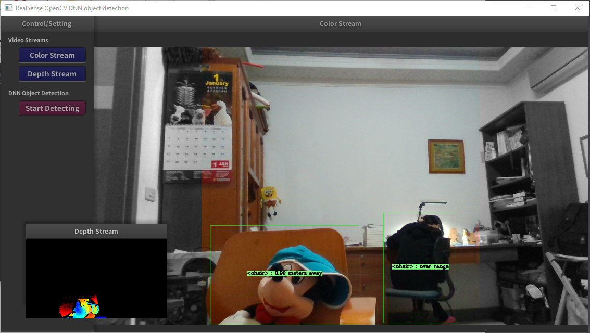
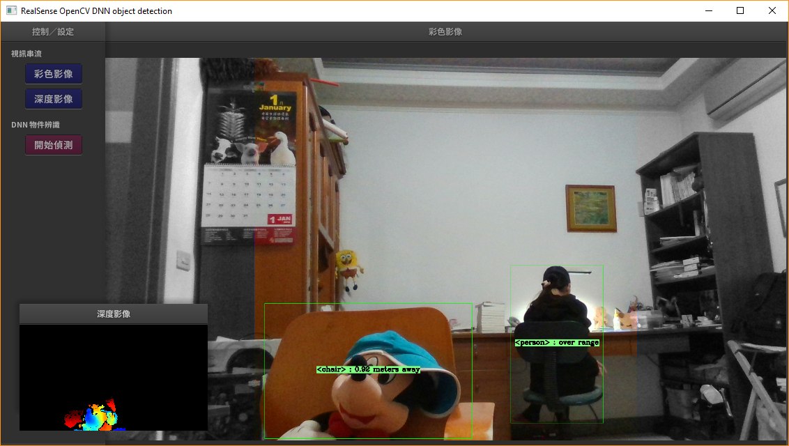

# rscvdnn
A Visual C++ project to test run the *OpenCV DNN object detection* with *RealSense* camera. The GUI utilizes a modified version of gorgeous [*nanogui*](https://github.com/wjakob/nanogui) and use *OpenGL shader* to render video streams.

The *Deep Neural Network* part of codes are derived from [*MobileNet Single-Shot Detector*](https://github.com/opencv/opencv/blob/master/samples/dnn/ssd_mobilenet_object_detection.cpp) example of *OpenCV*. The trained [*Caffe model*](https://github.com/chuanqi305/MobileNet-SSD) (included in project [resources](https://github.com/twMr7/rscvdnn/tree/master/resources)) is loaded at the beginning and used to classify 20 object classes from RGB image. Note that only the center square ROI is the hot detecting spot, the unused side bands shall turn gray by design. For each detected object, the distance is estimated from its detected location within corresponding depth frame.

## Screenshot
A test run video captured from screen is available on YouTube [**here**](https://youtu.be/PoBSpZ8VH08).




## Build Instruction

This VC++ project rely on the integration environment of [*vcpkg*](https://github.com/Microsoft/vcpkg) ports. Follow the [instruction](https://github.com/Microsoft/vcpkg/blob/master/README.md) to install vcpkg and run `.\vcpkg integrate install`, then install following dependency ports with `.\vcpkg install <port_name>:x64-windows`:
 
- **opencv**
- **realsense2**
- **poco**
- **eigen3**
- **stb**
- **glfw3**

, where *eigen3*, *glfw3*, and *stb* ports need to setup additional static liked packages for *nanogui* to build. Please create a file `"x64-windows-static-md.cmake"` in `vcpkg/triplets` folder with the following contents,
```
set(VCPKG_TARGET_ARCHITECTURE x64)
set(VCPKG_CRT_LINKAGE dynamic)
set(VCPKG_LIBRARY_LINKAGE static)
``` 
, then install these three ports with `.\vcpkg install <port_name>:x64-windows-static-md`.